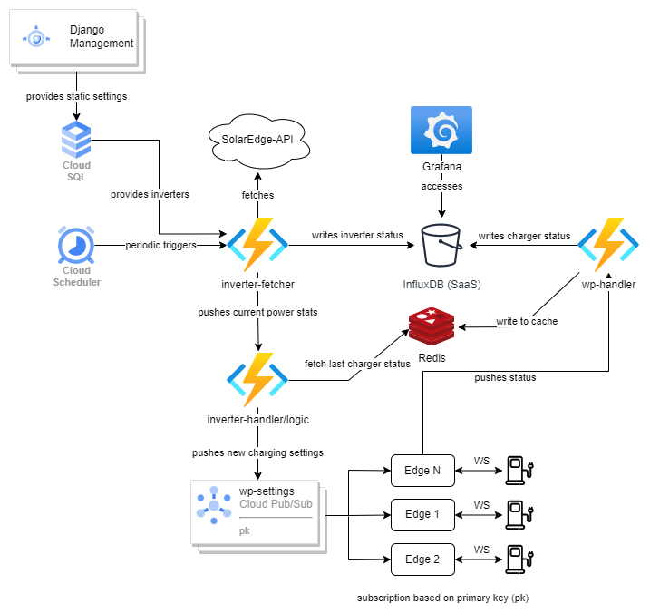

# CLC3: PV Smart Charging

## Idee
Der Plan ist, PV-Energie durch sogenanntes PV-Überschuss-Laden
möglichst effizient zu nutzen, indem man versucht, den Verbrauch mittels variabler
Lade-Geschwindigkeit an einem Ladegerät für E-Fahrzeuge periodisch an die
Erzeugung anzupassen. Die Strategie dahinter ist dabei die absolute Differenz
zwischen Produktion und Verbrauch so gering wie möglich zu halten, um
Energie-Zukauf, aber auch (tendenziell schlecht vergütete) Einspeisung zu
vermeiden. \
Zwar existieren bei den meisten Herstellern proprietäre Systemlösungen um den
PV-Überschuss möglichst intelligent einzusetzen, diese erfordern allerdings natürlich
auch, dass sämtliche verwendete Geräte desselben Herstellers (oft auch in der
passenden Revision) vorhanden sind. Dies führt in der Praxis zu mehreren
Einschränkungen, sodass es ohne eigener Lösung meistens Zwangsläufig zu einer
Kompromissentscheidung beim Kauf der benutzten Geräte kommt, da speziell bei
PV-Anlagen auch deren Features stark vom Hersteller abhängig und somit teils
extrem unterschiedlich geeignet sind.


## Aufgabenstellung/Ziel
In diesem Projekt wird dazu ein SolarEdge-Wechselrichter und ein
Fronius-Ladegerät verwendet. Relevante Daten sollen dabei periodisch gesammelt
werden und abhängig davon, das Ladegerät richtig konfiguriert werden.

Da der Fronius-Wattpilot nur über proprietäre Schnittstellen im WWW erreichbar ist, ist es notwendig Werte *Edge*-seitig lokal abzufangen oder zu setzen. Dazu ist ein entsprechender Client zu implementieren, welcher Werte aus Messages aus der Cloud entgegennimmt und Status-Werte in diese pusht. Abgesehen von diesem Edge-Client sind alle anderen Komponenten in der Cloud provisioniert.

Die Werte des Wechselrichters können periodisch über eine dokumentierte REST-API abgefragt werden. Nach jeder Abfrage wird das Stromfluss-Delta (unter Berücksichtigung des zuletzt gemeldeten Eigenverbrauchs des Ladegeräts) berechnet und der Ladestrom angepasst bzw. gestoppt.

Es soll dabei natürlich auch möglich sein, diese Logik zu unterbrechen und volle Ladeleistung zur Verfügung zu stellen, um bei Bedarf auch immer (schnell) laden zu können.

## Lösung
### Architektur
Folgende Architektur wurde in der **Google Cloud** umgesetzt:



Grundsätzlich war die Idee, das System Event-getrieben aufzubauen. \
Immer dann, wenn neue Messwerte vom Wechselrichter kommen, soll der Wattpilot den Ladevorgang entsprechend anpassen. Dazu müssen auch aktuelle Ladeinformationen, wie der aktuelle Ladestrom, vom Wattpilot zur Verfügung gestellt werden. Daraus ergeben sich folgende Event-Abläufe:
- **Wechselrichter-Update**: \
  Da Werte aktiv von einer REST-API abgefragt werden müssen, müssen diese Fetches periodisch getriggert werden. \
  Um den Event-getriebenen Ansatz möglichst beizubehalten, wurde dazu der *Cloud Scheduler* eingesetzt. Mit diesem können periodisch Nachrichten an ein Topic in Google *Cloud Pub/Sub* gepusht werden, wodurch der Ablauf getriggert wird. \
  Der `inverter-fetcher` greift daraufhin die abzufragenden Wechselrichter aus der *Cloud SQL*-DB ab und ruft dessen aktuelle Stromwerte ab. Diese werden anschließend in ein anderes Topic in Pub/Sub publiziert und in einer *InfluxDB2* gespeichert (ebenfalls in der Cloud; siehe unten). \
  Der `inverter-handler` (=Logik) reagiert auf diese Messwerte: Um den Ziel-Ladestrom zu berechnen, werden auch die aktuellen/letzten Werte des Wattpilots benötigt und dazu aus dem Redis-Cache geladen.

- **Wattpilot-Update**: \
  Damit diese Werte auch stets im Redis-Cache verfügbar sind, wird auch Edge-seitig bei relevanten Wertänderungen eine Nachricht in Pub/Sub veröffentlicht. \
  Der `wp-handler` nimmt diese entgegen und aktualisiert den Redis-Cache. Zusätzlich schreibt dieser die Werte zur Dokumentation und Nachvollziehbarkeit in InfluxDB.

#### Django
Django soll als Management/Konfigurations-Möglichkeit dienen. Praktisch ist dabei der integrierte OR-Mapper und vor allem auch eine integrierte Admin-GUI, welche einfache Administration Out-of-the-Box ermöglicht. \
Die Informationen werden dabei in der Klasse `Inverter` (=Wechselrichter) verwaltet, bestehend aus:
- `name: str`
- `token: str`
- `site_id: str`
- `wattpilot_id: int`
- `smart_charging_enabled: bool`

Die Felder `token` und `site_id` werden dabei zum Abfragen der aktuellen Stromwerte benötigt und seitens des Herstellers zur Verfügung gestellt. Die `wattpilot_id` referenziert den vor Ort befindlichen Wattpilot. Einem Wattpilot wird am Edge-Client eine fixe ID vergeben. So können Wattpiloten und Inverter flexibel verbunden werden. 

Django wird dabei als **App-Engine** zur Verfügung gestellt, einem **PaaS**-Dienst.

Man hat hierbei die Möglichkeit, zwischen zwei Varianten zu wählen:
1. **Standard**
   App wird in einer Sandbox bereitgestellt. Läuft kein Traffic, ist auch keine Instanz aktiv und bei erhöhtem Traffic werden automatisch mehrere Instanzen gestartet und Load-Balancing betrieben. \
   *Scale-to-Zero*: Die Startup-Zeit wird seitens Google nur mit "Seconds" angegeben - in der Praxis in diesem Fall meist unter 5 Sekunden. Im Hinblick auf die Kosten ist dies somit eine äußerst wirtschaftliche Lösung, da der Dienst auch nur zu Konfigurationszwecken (also relativ selten) verwendet wird.

2. **Flexibel** \
   Hier wird die App in Docker-Containern zur Verfügung gestellt. Die Startup-Zeit wird hier in "Minuten" angegeben, was *Scale-to-Zero unmöglich* macht und auch nicht von Google unterstüzt wird.

Die Standard-Variante ist in diesem Fall also, speziell für einen Prototyp, besser geeignet. Wäre man an einem Punkt, wo es Sinn machen würde, eine Instanz permanent am laufen zu halten, ist ein Umstieg leicht möglich. Die flexible Variante kann in diesem Fall bis auf den `app.yaml`-File zum Beschreiben der Infrastruktur (*IaC*) analog zur Standard-Variante eingesetzt werden. Mit `gcloud app deploy` wird anschließend provisioniert.

Eine alternative Lösung mit ähnlichen Vorteilen wäre auch der Einsatz von *Cloun Run*. In diesem Fall müssen Container-Images zwar vom User selbst erstellt bzw. beschrieben werden, allerdings ist das Start-Verhalten hier laut Google schnell genug, sodass auch hier *Scale-to-Zero* angewandt wird. Hier würde dieser Ansatz allerdings effektiv nur mehr Overhead in Form eines Dockerfiles o.ä. bewirken. 

Google stellt zu diesem Thema sogar spezifisch für Django [Anleitungen](https://cloud.google.com/python/django/appengine) bereit. Hier wird zum Beispiel auch erklärt, wie man eine Datenbankverbindung mit *Cloud SQL* herstellen kann - Sowohl für den Produktiveinsatz, als auch mittels Proxy-Applikation zum lokalen Entwickeln und Migrieren.

### Functions
Sämtliche andere Implementierungen (außer natürlich der Edge-Client und die SaaS-Anwendungen) wurden in Python 3.10 entwickelt und als *Cloud Function* eingesetzt, welche sich für den Event-getriebenen Ansatz - speziell in Kombination mit Pub/Sub - bestens eignen.

Zudem sind Kriterien wie permanente Verfügbarkeit/kurze Startup-Time, Performance und dergleichen in diesem Fall irrelevant. Wichtig ist, dass die Funktion zuverlässig ausgeführt wird, was dank Pub/Sub und automatischen Retries garantiert ist. Mehrfachzustellungen sind ebenfalls unproblematisch, könnten aber auch durch einfache Konfiguration der entsprechenden Pub/Sub-Subscription unkompliziert vermieden werden.

Authentifizierung oder Netzwerkkonfiguration sind im Google-Umfeld in diesem Setup zu vernachlässigen, da in einem Projekt ohnehin ein Default-Netzwerk angelegt wird und die Funktionen durch deren Service-Account auch authentifiziert sind. Es ist allerdings nötig, diesem Service-Account dazu die nötigen Berechtigungen zu geben. Verwendet man für mehrere/alle Functions denselben Service-Account, ist das eine einmalige Angelegenheit.

Das Deployment lässt sich aufgrund der Simplizität meines Erachtens nach flexibel und dennoch einfach mit der `gcloud`-CLI umsetzten - vor allem wenn alleine entwickelt wird:
```
gcloud functions deploy inverter-fetcher \
--region=europe-west3 \
--runtime=python310 \
--source=. \
--entry-point=handle \
--trigger-topic=inverter-fetches
```

### Messaging
Wie bereits erwähnt, wird als Messaging-Dienst Googles *Pub/Sub* verwendet, welcher asynchrone Message/Event-Zustellung durch das bekannte und namensgebende Publish/Subscribe-Pattern ermöglicht.

Je nach Subscription-Typ, müssen Nachrichten dabei entweder gepullt werden, oder werden an einen HTTP-Endpunkt gepusht. \
Die `google-cloud-pubsub`-Library, sowie auch die anderer Programmiersprachen, pullen die Nachrichten üblicherweise. Der Push-Typ ist allerdings für das Triggern der Functions geeignet und übergibt die Message als Inhalt im Body des Request.

Für dieses Projekt gelegen kommt zudem die Möglichkeit, Filter für Subscriptions definieren zu können. Damit lässt sich zum Beispiel gewährleisten, dass zu setzende Properties eines Wattpilots auch nur diesen bestimmten Wattpilot erreichen.\
Dazu kann man nach belieben Attribute mit String-Values zur Nachricht hinzufügen, gegen welche gefiltert werden kann.

**Code-Snippets zum gefilterten Publishen/Subscriben**
Zum Publishen können Attribute einfach spezifiziert werden (in diesem Fall via `kwargs`):

```python
data = json.dumps({"pk": pk, "prop": prop, "val": val})
publisher.publish(topic_path, data.encode('utf-8'), pk=f"{pk}")
```

Das Subscriben erfordert für jede(n) Filter(-kombination) eine eigene Subscription. \
Hier wird auf der Edge z.B. überprüft, ob die nötige Subscription bereits existiert und ansonsten automatisch erstellt:
```python
subscription_name = f'projects/{PROJECT_ID}/subscriptions/wp-edge-{WP_PK}T-sub'
project_path = f"projects/{PROJECT_ID}"
print(publisher.list_topic_subscriptions(request={"topic": sub_topic_name}))
for subscription in publisher.list_topic_subscriptions(request={"topic": sub_topic_name}):
    if f'wp-edge-{WP_PK}' in subscription:
        # subscription already exists
        break
else:
    # executing only if no break occured:
    # subscription missing, create new sub
    subscriber.create_subscription(request={"name": subscription_name, "topic": sub_topic_name, "filter": f'attributes.pk = "{WP_PK}"'})
future = subscriber.subscribe(subscription_name, sub_msg_handler)
```

### Cloud SQL
Als Datenbank wird Postgres in einer Single-Instanz ohne Hochverfügbarkeit und Replicas verwendet - Um Kosten zu sparen.

In der Google-Cloud können einfache Lese-Replikas und Hochverfügbarkeit mit einem Klick aktiviert werden. In Folge sind nur Zone und VM zu konfigurieren. \
Die Replikas sind dabei nicht standardmäßig load balanced, Hochverfügbarkeit bringt diese Eigenschaft hingegen (natürlich) schon mit.

Bei mehr Traffic könnte man so also auch die Datenbank entlang mit Django (und den Funktionien ohnehin) problemlos skalieren.

### InfluxDB
Da es sich bei den erhobenen Daten letztendlich um Sensor/IoT-Daten mit konkretem/relevantem Zeitstempel handelt, macht einen Zeitreihendatenbank Sinn - Zudem Werte zwar nicht hoch-frequent, aber doch u.U. mehrfach pro Sekunde pro Client geschrieben werden. Außerdem lässt sich damit speziell in Kombination mit Grafana relativ schnell eine brauchbare Visualisierung umsetzen. 

InfluxDB als Cluster kann bei Google seit kurzer Zeit nurmehr als InfluxDB Enterprise als Fully-Managed SaaS bezogen werden.

Abonniert man den Service im Google-Marketplace werden automatisch in der Influx-Cloud Instanzen allokiert und dem Google-Account zugeordnet. Über SSO loggt man sich direkt bei Influx in einem Portal ein und erreicht die Schreib/Lese-API über das WWW. \
Berechtigungstoken für Client sind somit ebenfalls über die Influx-GUI zu verwalten.

### Secrets
Folgende Secrets werden in Googles *Secret Manager* verwaltet:
- DB-Zugriff für Django
- DB-Zugriff für `inverter-fetcher`
- Influx Token zum Schreiben

Zugriff auf Secrets:
```python
client = secretmanager.SecretManagerServiceClient()
name = f"projects/{PROJECT_ID}/secrets/{DB_SECRET_NAME}/versions/latest"
payload = json.loads(client.access_secret_version(name=name).payload.data.decode("utf-8"))
```
Wichtig ist dabei, dass der ausführende Service-Account zum Zugriff auf die jeweiligen secrets berechtigt ist (Mit wenigen Klicks in GUI machbar).

### Edge-Client
Der Edge-Client bedient sich einer [modifizierten Version](https://github.com/niSeRdiSeR/wattpilot) eines [Projekts](https://github.com/joscha82/wattpilot) aus der Community.

Es handelt sich dabei um einen Wattpilot(Websocket)-Client, welcher die (nicht dokumentierte) Websocket-Kommunikation in einer interaktiven Shell abstrahiert. \
Der Client kann auch Bridge zwischen Wattpilot und einem MQTT-Broker fungieren, was Automatisierung ermöglicht. Leider funktionierte bei mir (und auch bei anderen) zwar nur die Shell in der Ursprungsversion, in der geforkten Version habe ich diese Stelle allerdings gefixt bzw. so adaptiert, dass sie für meine Zwecke funktioniert.

Diese MQTT<->Wattpilot-Bridge wird gemeinsam mit einem MQTT-Broker (mosquitto) und dem eigentlichen Edge-Client (einer MQTT<->Pub/Sub) als `docker-compose`-Stack eingestzt.

**Authentifizierung** \
Zum Authentifizieren gegen Pub/Sub kann ein JSON-Keyfile für externe Service-Accounts in der Google-Cloud-Console (GUI) erzeugt und runtergeladen werden. \
Dieser wird vom Hostsystem in den Container gemapped und der Pfad als Environment-Variable `GOOGLE_APPLICATION_CREDENTIALS` gesetzt. In diesem Pfad suchen die Google-Libraries implizit, wenn sie verwendet werden.

### Kosten/CO2
Damit sich die Ausführung dieses Systems ökonomisch (und hoffentlich auch ökologisch) rentiert, war ein wichtiger Punkt auch die Kosten so gering wie möglich zu halten. GCP bietet auch die Möglicheit, den CO2-Ausstoß zu betrachten, allerdings immer nur von vollendeten Monaten, weshalb dazu leider keine Statistiken vorhanden sind. Nimmt man aber an, dass Kosten und CO2-Ausstoß korrelieren, geben die Kosten vielleicht zumindest auch einen Eindruck der CO2-Bilanz.

#### Rechenzeit
**Functions:**
- < 2 Mio. Aufrufe  -> gratis
- ab 2 Mio.         -> 0,40$/1.Mio. Aufrufe

**App Engine:** \
Verschiedene Tiers mit stark unterschiedlichen Stundenpreisen von ~0.05-0.35$/h.

Es gibt dabei auch ein Gratiskontingent an Instanzzeit der schwächeren Tiers. Dieses ist mit 28h an *F*-Instanzen und 9h and *B*-Instanzen zwar rechenschwach, aber würde für dieses Projekt voraussichtlich gänzlich kostenlosen Betrieb der Django-Instanz(en) bedeuten.

Aktuell fallen somit insgesamt keine Kosten für die Rechenzeit an.

#### Traffic
Preistreibend ist in diesem Projekt der Traffic der durch Pub/Sub erzeugt wird, vor allem dann wenn er auch die Google-Cloud verlässt und zum Edge-Client geht. Doch auch hier sind die Preise mit 40$ pro TiB Traffic human, wobei sich dieser Preis bei ausgehendem Traffic aus der Cloud um 0.02$ pro GB in Europa erhöht. Die ersten 10GB sind gratis. 

Eine aus Kostensicht interessante Alternative (die ich leider zu spät entdeckt habe), ist *Pub/Sub-Lite*, welches im Grunde dasselbe macht, allerdings standardmäßig nicht geo-repliziert (was beim normalen Pub/Sub der Fall ist). Nachteil ist, ist dass Pub/Sub-Lite bzw. dessen Kapazitäten manuell im Vorhinein konfiguriert werden müssen. \
Das kann zu ungenützten, bezahlten Ressourcen führen, bewahrt aber auch vor potenziellen Überraschungen.

#### Datenbanken
Am teuerten kommen die Datenbanken. Cloud SQL kostet auch in der schächsten Konfiguration knappe 40$ im Monat für 1 vCore, 3.75GB RAM und 10GB HDD. Da die Daten aber auch in der Cloud bleiben, ist hier mit relativ stabilen Kosten zu rechnen.

Die Kosten der Influx-Cloud hingegegen sind schwer vorherzusagen, da seitens Google aufgrund externer Cloud Statistiken fehlen und Influx diese nicht zur Verfügung stellt und für Information auf Google verweist. Hier findet man zumindest die Tarife: \
Das Speichern in der Influx-DB kostet umgerechnet laut Google pro GB über 1.80€, Abfragen hingegen nur etwa 0.08€ pro GB. Es dürfte sich hier vermutlich um einen Einheitenfehler handeln, allerdings wird erst zum Monatsende abgerechnet.